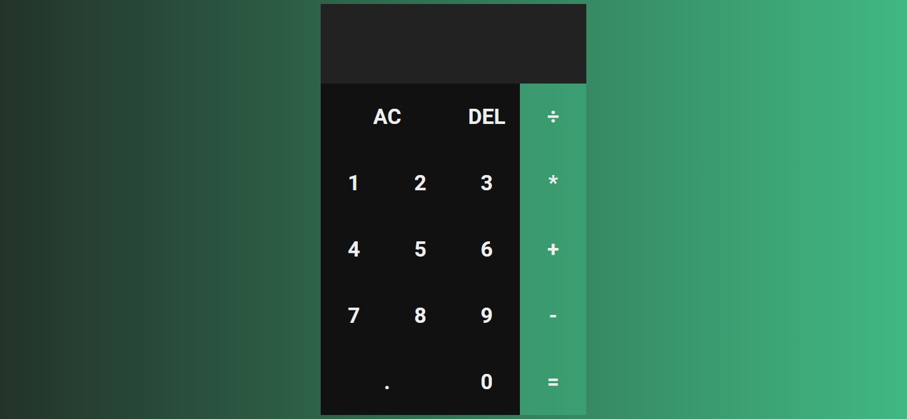

<h1 align="center"> Calculadora </h1>

Repositório feito para a criação de uma calculadora. 

  <a href="#technologies">Technologies</a>&nbsp;&nbsp;&nbsp;|&nbsp;&nbsp;&nbsp;
  <a href="#project">Project</a>

 

  

## 🚀 Technologies

Esse projeto foi desenvolvido com as seguintes tecnologias:

- HTML e CSS
- JavaScript
- Git e Github

## 💻 Project

A calculadora pode ser utilizada para realizar calculos envolvendo as 4 operações (adição, subtração, multiplicação e divisão)

- [Visite o projeto online](https://calculadora-raulrodmo.netlify.app/)

---

Made with 💜 by raulrodmo

